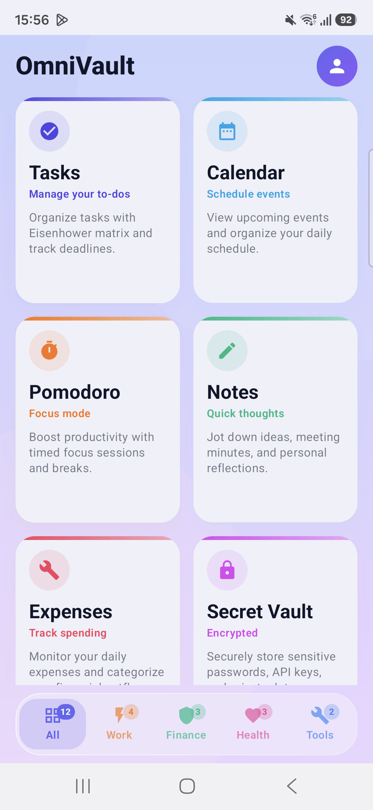
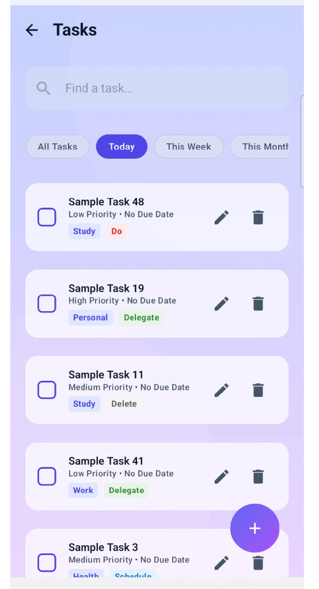
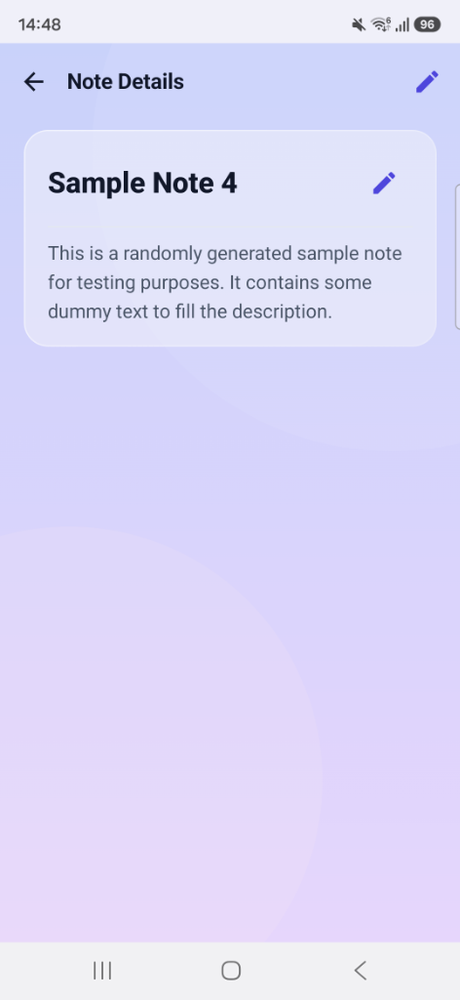

# 🔐 OmniVault

> **An all-in-one, offline-first Android productivity, security & utility hub — built with Jetpack Compose, Material 3, and Kotlin.**

TaskVault combines **11 essential tools** into a single, beautifully designed app with a frosted glassmorphic UI system so you can manage tasks, track expenses, log workouts, track sleep, save web bookmarks, track debts, log moods, stay focused, and secure your secrets — all in one place.

---

## 📸 Screenshots Showcase

<p align="center">
  
  &nbsp;&nbsp;
  
  &nbsp;&nbsp;
  
</p>

<p align="center">
  <em>📱 Tools Dashboard Hub &nbsp;&nbsp;&nbsp;&nbsp;&nbsp;&nbsp;&nbsp;&nbsp;&nbsp;&nbsp;&nbsp;&nbsp;&nbsp;&nbsp;&nbsp;&nbsp; 📝 Tasks & Priority Matrix &nbsp;&nbsp;&nbsp;&nbsp;&nbsp;&nbsp;&nbsp;&nbsp;&nbsp;&nbsp;&nbsp;&nbsp;&nbsp;&nbsp;&nbsp;&nbsp; 📄 Note Details & Edit Mode</em>
</p>

---

## ✨ Key Features & Tools

| Icon | Tool / Feature | Highlights & Capabilities |
|:---:|---|---|
| ✅ | **Tasks (To-Dos)** | Task management with Eisenhower priority matrix, translucent pastel tags, task details modal, and explicit completion confirmation. |
| 📅 | **Calendar** | Integrated month calendar grid in a unified scroll container, horizontal drag gestures for month swiping, and **Tasks vs Events** segmented tab control with live counts. |
| 🍅 | **Pomodoro Timer** | Focus timer with circular progress ring, ambient soundscapes (White Noise, Rain, Cafe), **Finish Early** button, and a dedicated **View Focus History** glass modal. |
| 📝 | **Notes** | Jot down notes with an explicit **Read-Only View Mode** and **Edit Mode** toggled strictly via the Edit action button. |
| 💸 | **Expense Tracker** | Monitor spending with live **Today**, **This Week**, **This Month**, and **This Year** period summary cards and transaction logs. |
| 🔒 | **Secret Vault** | Store passwords, API keys, and sensitive data behind biometric authentication. |
| 📷 | **QR Scanner** | Instantly scan and read QR codes and barcodes. |
| 💳 | **Credit / Debit Ledger** | Track who owes you and who you owe with transaction logs and net balance indicators. |
| 😄 | **Mood Journal** | Log daily moods with emojis, reflections, and a chronological history timeline. |
| 🔖 | **Bookmarks** | Save and categorize URLs, articles, and web content for later reading. |
| 🏋️ | **Fitness Tracker** | Track gym workouts (with target muscle group tags), running distance/duration, and sports activities. |
| 😴 | **Sleep Log** | Log nightly sleep schedules, duration in hours/minutes, and quality ratings. |

---

## 🎨 Design System & UI Highlights

- **Categorized Bottom Navigation Bar:** Floating glass bottom bar with 5 category tabs (**All**, **Work**, **Finance**, **Health**, **Tools**), live badge counters, and vibrant signature category accent colors (Indigo, Orange, Emerald, Pink, Royal Blue).
- **Glassmorphic Surface Design (`GlassCard`):** Frosted glass fill (40% - 55% translucency) replacing harsh opaque rectangles across both Light & Dark modes.
- **Spring Touch Physics (`.pressScale()`):** Interactive touch feedback micro-animations on cards, action buttons, and filter chips.
- **Delete Confirmation Dialogs:** Explicit confirmation popups ("Do you want to delete...?") across Notes, Tasks, and Expenses to prevent accidental deletion.
- **Dedicated Debug Tools:** Scrollable modal dialog in Profile settings to inject test sample data for all 11 features with instant toast feedback.

---

## 🛠 Tech Stack

| Layer | Technology |
|---|---|
| **Language** | [Kotlin](https://kotlinlang.org/) |
| **UI Framework** | [Jetpack Compose](https://developer.android.com/jetpack/compose) + Material 3 |
| **Widgets** | [Jetpack Glance](https://developer.android.com/jetpack/compose/glance) |
| **Dependency Injection** | [Dagger Hilt](https://dagger.dev/hilt/) |
| **Local Database** | [Room Database](https://developer.android.com/training/data-storage/room) |
| **Remote Database** | [Firebase Realtime Database](https://firebase.google.com/products/realtime-database) |
| **Authentication** | [Firebase Auth](https://firebase.google.com/docs/auth) (Email/Password + Google Sign-In) |
| **Biometric Security** | [AndroidX Biometric](https://developer.android.com/training/sign-in/biometric-auth) |
| **Async & State** | [Kotlin Coroutines & Flow](https://kotlinlang.org/docs/coroutines-overview.html) |
| **Navigation** | Compose Navigation |

---

## 🏗 Architecture

```
app/
├── data/
│   ├── local/          # Room entities, DAOs, and database
│   ├── remote/         # Firebase remote data sources
│   └── repository/     # Repository implementations
├── di/                 # Hilt dependency injection modules
├── domain/             # Repository interfaces and domain models
├── ui/
│   ├── auth/           # Login & Registration screens
│   ├── bookmark/       # Bookmarks screen & ViewModel
│   ├── calendar/       # Calendar screen (Tasks & Events tabs)
│   ├── components/     # Shared UI components (GlassCard, CategoryBottomBar, etc.)
│   ├── expense/        # Expense tracker screen & ViewModel (4 period cards)
│   ├── fitness/        # Fitness tracker screen & ViewModel
│   ├── ledger/         # Credit/Debit ledger screens & ViewModel
│   ├── mood/           # Mood journal screen & ViewModel
│   ├── notes/          # Notes list & detail screens (Read-only / Edit modes)
│   ├── pomodoro/       # Pomodoro timer screen & ViewModel (Finish Early & History)
│   ├── profile/        # User profile & Debug Tools modal
│   ├── scanner/        # QR code scanner
│   ├── sleep/          # Sleep Log screen & ViewModel
│   ├── theme/          # Curated color palette, typography, and theming
│   ├── todos/          # Task list & add task screens
│   ├── tools/          # Central Tools Dashboard Hub
│   └── vault/          # Secret vault screens
├── widget/             # Jetpack Glance home screen widgets
├── worker/             # Alarm scheduler & receivers
└── MainActivity.kt
```

---

## 🚀 Getting Started

### Prerequisites
- Android Studio Hedgehog or later
- JDK 17+
- An Android device or emulator (API 26+)

### Setup

1. **Clone the repository:**
   ```bash
   git clone https://github.com/kaisarnajar/taskvault.git
   cd taskvault
   ```

2. **Configure Firebase:**
   - Go to the [Firebase Console](https://console.firebase.google.com/)
   - Add an Android app with package name `app.taskvault`
   - Download `google-services.json` and place it in the `app/` directory
   - Enable **Firebase Authentication** (Email/Password) and **Realtime Database**

3. **Open in Android Studio:**
   - Open the project and let Gradle sync complete

4. **Run the app:**
   - Select your target device/emulator and click ▶️ Run

---

## 📊 Codebase Stats

| Metric | Value |
|---|---|
| **Kotlin Source Files** | 115 files |
| **Lines of Kotlin Code** | 11,476 lines |
| **Total Lines of Code** | 11,791 lines |
| **Built-in Tools** | 11 tools |
| **Home Screen Widgets** | 5 widgets |

---

## 📄 License

This project is open source and available under the [MIT License](LICENSE).

---

<p align="center">
  Built with ❤️ using Kotlin & Jetpack Compose
</p>
